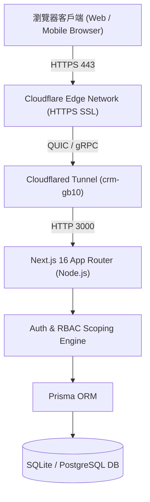
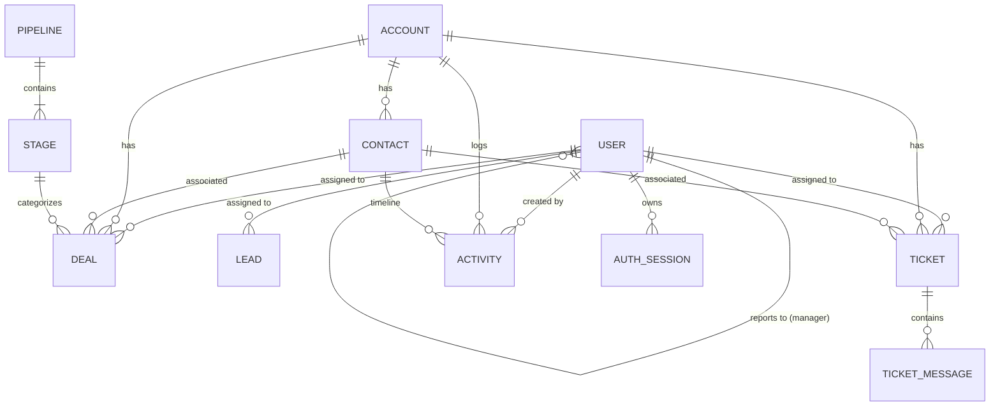

# NexCRM - 系統開發規劃與架構設計書 (Development Plan & Architecture)

---

## 📌 1. 專案背景與需求規劃 (Project Background & Requirements)

### 1.1 專案定位
NexCRM 是一套為企業自用設計的現代化、輕量級全功能 Web-based 客戶關係管理系統。系統旨在克服傳統大型 CRM 笨重、配置繁瑣、授權高昂的痛點，以最簡潔直覺的介面整合**銷售管理 (SFA)**、**行銷自動化 (Marketing)**、**客戶服務 (Support)** 與 **高階決策分析 (Executive Reports)**。

> **目前執行基線（2026-08-23）**：首次 ADMIN bootstrap 與強制密碼、RBAC/ABAC、cursor pagination、Contact 360 分拆、主管循環防護、PostgreSQL enum migration 與測試已完成。最近一次驗證為 `npm run check`、`npm run test:postgres`、`npm run test:e2e` 全部通過；正式 PostgreSQL cutover 與營運治理仍未完成。

### 1.2 核心業務需求矩陣
1. **單一企業自用，輕量敏捷**：無多租戶冗餘負擔，架構簡潔直觀。
2. **多區域與階層組織架構**：區域槽位支援三個市場與總部：NORTH=第一市場(中南美/菲律賓)、CENTRAL=第二市場(美歐/俄印/台灣)、SOUTH=第三市場(俄羅斯/中東)、OVERSEAS=總部與其他，以及全區 (ALL)。
3. **多人獨立帳號密碼登入 (Authentication)**：每位業務與員工皆有自己的 Username 與 Password。
4. **嚴格分區權限與資料隔離 (Data Scoping)**：
   * **Sales (業務員)**：僅能檢視與操作自己負責區域的資料。
   * **Regional Manager (區域主管)**：能檢視該區域下 Sales 與訂單管理員的商機與進展。
   * **Order Admin (訂單管理員)**：作為 Sales Assistant，在指定區域處理商機／訂單資料。
   * **Marketing Manager (市場部主管)**：管理市場部專員與全區行銷工作流。
   * **Admin (系統管理者)**：獨立負責人員組織架構配置、責任區域分配與系統維護。
   * **GM (總經理)**：獨立高階決策帳號，具備全公司穿透視角與決策報表。
5. **總經理決策分析報表 (Executive Decision Reports)**：提供目標達成率、分區營運績效矩陣、業務排行榜與可列印視圖。
6. **Cloudflare 對外發布**：綁定正式域名 `crm.avision-gb10.org`，支援遠端安全訪問。
7. **開源版本控管**：同步維護於 GitHub `https://github.com/brianshih04/lightweight-crm`。

---

## 🏗️ 2. 系統架構與技術棧 (Architecture & Tech Stack)



### 2.1 前端層 (Frontend Layer)
* **核心框架**：Next.js 16 (App Router) + React 19
* **樣式庫**：Tailwind CSS (響應式設計 + 現代化微圓角/毛玻璃質感)
* **圖示庫**：Lucide React
* **圖表視覺化**：Recharts
* **拖曳互動**：@dnd-kit (核心支援 Kanban 商機看板拖曳)

### 2.2 後端與服務層 (Backend & Service Layer)
* **API 架構**：Next.js Route Handlers (RESTful JSON APIs)
* **認證機制**：資料庫可撤銷 opaque Session；Cookie 僅保存高熵 token，伺服器保存 token hash、expiry、revocation 與 lastSeenAt
* **請求防護**：登入 identity/IP 節流；所有 state-changing API 強制同源 Origin 驗證
* **稽核追蹤**：Proxy 產生 request ID 與安全標頭；AuditEvent 保存 actor/action/resource/result，刪除 User 不會刪除歷史
* **API 合約**：共享 Zod request/response schemas、DTO allowlist、JSON body/query limits、統一錯誤 envelope 與 cursor pagination headers
* **重送安全**：建立型 mutation 支援 24 小時 `Idempotency-Key` replay；資源、AuditEvent 與 response snapshot 同 transaction
* **資料庫 ORM**：Prisma ORM 5.x
* **資料庫引擎**：SQLite（本地快速開發；單 process FIFO 寫入）/ PostgreSQL 16（generated native-enum schema、baseline migrations、CI 高併發驗證）

### 2.3 網路與部署層 (Network & Deployment)
* **安全通道**：Cloudflare Tunnel (`cloudflared`)，無需對外開啟防火牆連接埠
* **正式網域名稱**：`crm.avision-gb10.org` (支援 Auto SSL 憑證)

---

## 🗄️ 3. 資料庫實體關聯模型 (Data Model / Prisma Schema)



### 核心實體說明：
1. **`User` (使用者與組織)**：`id`, `username`, `password`, `name`, `email`, `role`, `department`, `region`, `title`, `managerId`。
2. **`Account` (企業客戶)**：`id`, `name`, `industry`, `region`, `phone`, `address`, `customFields`。
3. **`Contact` (客戶聯絡人)**：`id`, `name`, `email`, `phone`, `title`, `region`, `tags`, `accountId`。
4. **`Lead` (潛在線索)**：`id`, `name`, `company`, `email`, `phone`, `region`, `source`, `score`, `status`, `assignedToId`。
5. **`Pipeline` & `Stage` (銷售管線與階段)**：階段順序、代表顏色、成交機率 (Probability)。
6. **`Deal` (商機)**：`id`, `title`, `value`, `currency`, `region`, `stageId`, `contactId`, `accountId`, `assignedToId`, `status`。
7. **`Ticket` & `TicketMessage` (售後工單與雙軌對話)**：`ticketNumber`, `subject`, `status`, `priority`, `region`, `slaDueAt`, `isInternal`。
8. **`Activity` (統一活動時間軸)**：跨部門活動紀錄（會議、電話、階段變更、信件）。
9. **`Campaign` & `Workflow` (行銷活動與工作流程)**：動態受眾分群、觸發器與排程推播。
10. **`AuthSession` & `LoginThrottle` (登入安全)**：opaque token hash、到期/撤銷/last-seen，以及跨程序持久化的帳號/IP 登入節流。
11. **`AuditEvent` (安全稽核)**：保存 request ID、actor、action、resource、result 與 keyed-HMAC IP pseudonym，刻意不設 User 外鍵。
12. **`TicketSequence` (工單序號)**：以年度 counter 在建立工單 transaction 內原子遞增，取代 `count()+1` 競態。
13. **查詢完整性**：region/assignee/status/createdAt 與主要外鍵具複合索引；`Stage(pipelineId, order)` 不可重複。
14. **金額精度**：Deal `value` 使用 Prisma Decimal，報表透過 Decimal 加總後才在 DTO 邊界轉為 number。

---

## 🛡️ 4. 角色權限與區域隔離設計 (RBAC & ABAC Security Architecture)

系統後端採用統一的安全中介模組 (`src/lib/auth.ts`)，在所有 API 請求執行前進行使用者鑑權與資料範圍過濾：

業務階層定義為「GM（總經理）→ 市場部主管／區域主管 → Sales」；`ORDER_ADMIN` 為區域主管管理的 Sales Assistant 支援角色，`ADMIN` 則是獨立的系統管理角色。

```
+---------------------------------------------------------------------------------------------------------+
| 使用者角色 (Role)    | 負責區域 (Region) | 資料檢視與操作範圍 (Scope Filter)                                   |
+---------------------------------------------------------------------------------------------------------+
| ADMIN (系統管理者)    | ALL               | 全公司穿透視角；可存取 /settings/users 建立與管理所有成員及責任區域 |
| GM (總經理)          | ALL               | 全公司穿透視角；可存取 /reports 決策報表與業績排行榜                |
| MARKETING_MANAGER (市場部主管)| ALL           | 管理市場部專員、行銷推播、受眾分群與工作流                          |
| SALES_MANAGER (區域主管)| NORTH / CENTRAL...| 僅限所屬區域；可查看 Sales 與訂單管理員的商機與進展              |
| ORDER_ADMIN (訂單管理員)| NORTH / CENTRAL...| Sales Assistant；可在所屬區域讀取／建立／更新商機資料             |
| SALES (Sales)          | NORTH / CENTRAL...| 僅限所屬區域且指派給個人的商機與客戶 (assignedToId = user.id)       |
| MARKETING (市場部專員) | ALL               | 行銷推播、受眾分群與工作流管理                                      |
| SUPPORT (客服專員)    | ALL               | 售後工單收件箱、SLA 監控與工單回覆                                  |
+---------------------------------------------------------------------------------------------------------+
```

---

## 🚀 5. 模組開發里程碑與完成進度 (Development Milestones)

| 里程碑階段 | 模組名稱 | 核心功能與成果 | 狀態 |
| :--- | :--- | :--- | :---: |
| **Phase 1** | **需求規劃與核心 SFA 看板** | 需求分析、Prisma Schema 設計、視覺化 Kanban 看板、線索評分與一鍵轉換 | ✅ 完成 |
| **Phase 2** | **客戶 360 與統一時間軸** | 企業客戶 (Accounts)、聯絡人 (Contacts)、跨模組 Activity 統一時間軸 | ✅ 完成 |
| **Phase 3** | **行銷自動化與客服工單** | 受眾分群、EDM 活動推播、工作流程引擎、工單收件箱、SLA 預警、雙軌回覆 | ✅ 完成 |
| **Phase 4** | **遠端部署與版本控管** | GitHub 倉庫建立、Cloudflare Tunnel 配置、綁定 `crm.avision-gb10.org` | ✅ 完成 |
| **Phase 5** | **多區域與總經理決策報表** | 北中南海外分區支援、`/reports` 總經理決策分析報表、分區營運矩陣 | ✅ 完成 |
| **Phase 6** | **認證權限與人員分區管理** | 一次性首位 ADMIN、scrypt 密碼、可撤銷 opaque Session、登入節流、CSRF Origin 防護與權限矩陣 | ✅ 完成 |
| **Phase 7** | **嚴格架構改善與可交接品質門檻** | PostgreSQL migration/runtime、API contract/DTO、cursor pagination、Contact 360、Audit、Playwright E2E、GM／市場部主管／區域主管／Sales 階層與 Order Admin | ✅ 本機／CI gate 完成；正式營運治理待辦 |

---

## 📡 6. 後端 API 規格表 (RESTful Endpoints)

| 方法 | 路徑 | 存取權限 | 功能說明 |
| :--- | :--- | :--- | :--- |
| `POST` | `/api/auth/login` | 公開、同源 | 驗證帳密、套用 identity/IP 節流並簽發 opaque Session Cookie |
| `POST` | `/api/auth/logout` | 已登入、同源 | 撤銷目前 Session；`allDevices: true` 可撤銷該使用者全部 Session |
| `GET` | `/api/auth/me` | 已登入 | 取得當前登入者資訊與責任區域 |
| `GET` | `/api/audit` | Admin | 以 cursor、result/action/resource filter 查詢安全稽核事件 |
| `GET` | `/api/users` | Admin / GM | 取得組織人員名單與主管階層關聯 |
| `POST` | `/api/users` | Admin / GM | 建立新成員帳號並指派負責區域與主管 |
| `PATCH`| `/api/users/[id]` | Admin / GM | 編輯人員資料、重設密碼與調整責任區域 |
| `DELETE`| `/api/users/[id]` | Admin / GM | 刪除指定成員帳號 (保護 Admin 不被刪除) |
| `GET` | `/api/reports/executive` | GM / Admin / Manager | 取得高階營運指標、分區矩陣與業務排行榜 |
| `GET` | `/api/deals` | 依角色過濾 | 取得銷售管線階段與商機列表 (自動區域隔離) |
| `POST` | `/api/deals` | Sales / Order Admin / Manager | 建立新商機並關聯客戶與區域；Order Admin 僅能在所屬區域建立 |
| `PATCH`| `/api/deals` | Sales / Order Admin / Manager | 拖曳切換商機階段或更新狀態並套用區域 scope |
| `GET` | `/api/leads` | 依角色過濾 | 取得潛在線索列表 (自動區域隔離) |
| `POST` | `/api/leads` | 業務人員 | 建立新線索或一鍵轉換為客戶與商機 |
| `GET` | `/api/contacts` | 依角色過濾 | 搜尋與取得聯絡人資料 |
| `POST` | `/api/contacts` | 業務人員 | 建立新聯絡人並寫入活動紀錄 |
| `GET` | `/api/accounts` | 依角色過濾 | 取得企業客戶資料與關聯商機工單 |
| `GET` | `/api/tickets` | 客服 / 全員 | 取得工單列表與 SLA 到期狀態 |
| `POST` | `/api/tickets/[id]` | 客服人員 | 發布公開回覆或內部協作筆記 |

---

## 🌐 7. 網路拓撲與 Cloudflare Tunnel 部署架構

1. **本機服務**：Next.js Production 服務監聽於 `http://localhost:3000`。
2. **Cloudflare Connector**：
   * Tunnel UUID: `e069e611-2795-4929-9d40-486db6c1784c`
   * 設定檔路徑: `C:\Users\Brian\.cloudflared\config-crm.yml`
   * Ingress 規則: `hostname: crm.avision-gb10.org` -> `service: http://localhost:3000`
3. **DNS 路由**：CNAME `crm.avision-gb10.org` 路由至 Cloudflare Edge Anycast 網路，享有全自動 SSL 加密保護。

---

## 🔮 8. 未來升級規劃與功能藍圖 (Phase 7+ Roadmap)

> 上線前阻斷項：Git history 機密清理／憑證輪替、MFA/SSO、外部 alert channel、正式 PostgreSQL cutover、registry／流量 rollback、自動加密離機備份、更多瀏覽器 E2E、集中式 logs/metrics/traces。

* [ ] **真實 SMTP / SendGrid 郵件發送整合**：串接企業專屬 SMTP 伺服器，直接對外發送真實行銷活動信件。
* [ ] **LINE Official Account & WhatsApp Webhook 串接**：將客戶社群訊息即時轉化為客服工單與潛在線索。
* [ ] **行動端 PWA (Progressive Web App)**：支援外勤業務手機離線查閱客戶與即時打卡備忘。
* [ ] **AI 銷售預測與 Copilot 助手**：透過 LLM 自動分析客戶對話摘要並預測商機結案機率。

---
*NexCRM 架構研發小組 · 2026*
